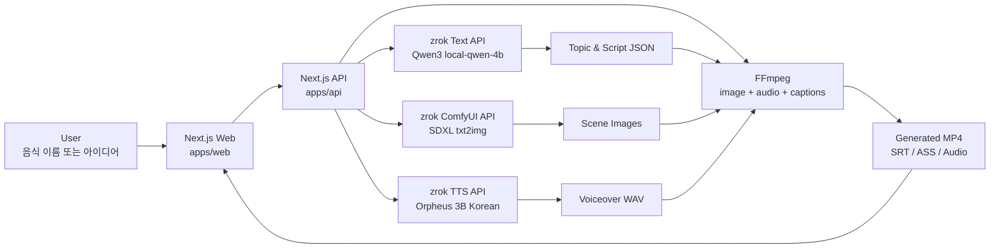

# 골때리는 건강 가이드 스튜디오

음식 이름이나 짧은 아이디어를 입력하면 AI가 숏츠 주제, 대본, 이미지, TTS 음성, 자막, MP4 영상을 한 번에 생성하는 풀스택 AI 콘텐츠 제작 도구입니다.

[](https://nextjs.org/)
[](https://www.typescriptlang.org/)
[](https://vercel.com/)
[](https://github.com/comfyanonymous/ComfyUI)
[](https://ffmpeg.org/)

## Overview

이 프로젝트는 음식 캐릭터 밈과 건강 정보를 결합해 짧은 영상 콘텐츠를 빠르게 제작하기 위한 MVP입니다.

- 음식/아이디어 기반 숏츠 주제 후보 5개 생성
- 선택한 주제 기반 4씬 대본 생성
- ComfyUI SDXL 기반 씬별 이미지 생성
- Orpheus 한국어 TTS 기반 음성 생성
- 자막 파일 생성 및 FFmpeg MP4 합성
- 프론트엔드와 백엔드를 분리한 Next.js 모노레포 구조
- zrok으로 공개된 로컬 AI 모델 서버와 Vercel 배포 API 연동

## Demo

- Web: [https://golddaegeon-health-guide-studio-web.vercel.app](https://golddaegeon-health-guide-studio-web.vercel.app)
- API Health: [https://golddaegeon-health-guide-studio-api.vercel.app/api/health](https://golddaegeon-health-guide-studio-api.vercel.app/api/health)
- Repository: [https://github.com/iris112-sung/golddaegeon-health-guide-studio](https://github.com/iris112-sung/golddaegeon-health-guide-studio)

## Tech Stack

| Layer | Stack |
| --- | --- |
| Frontend | Next.js App Router, React 19, TypeScript, Tailwind CSS, lucide-react |
| Backend | Next.js Route Handlers, TypeScript, Zod |
| Text AI | zrok 공개 Qwen3 4B 계열 로컬 LLM API |
| Image AI | zrok 공개 ComfyUI API, SDXL checkpoint |
| TTS AI | zrok 공개 Orpheus 3B Korean TTS API |
| Video | FFmpeg, ASS/SRT captions |
| Deploy | Vercel Web, Vercel API, GitHub |

## Architecture



## Workflow

1. 사용자가 음식 이름 또는 아이디어를 입력합니다.
2. API가 zrok 텍스트 모델에 주제 후보 생성을 요청합니다.
3. 선택된 주제로 숏츠 대본과 씬 구성을 생성합니다.
4. 각 씬의 `imagePrompt`를 ComfyUI `/prompt`에 등록합니다.
5. `/history/{prompt_id}`를 polling하고 `/view`로 이미지를 가져옵니다.
6. 씬 대사를 Orpheus TTS `/tts`에 전달하고 `/audio/{filename}.wav`를 가져옵니다.
7. FFmpeg가 이미지, 오디오, 자막을 합성해 MP4를 생성합니다.

## Project Structure

```text
.
├── apps
│   ├── api
│   │   └── src
│   │       ├── app/api
│   │       └── lib/ai
│   └── web
│       └── src
│           ├── app
│           └── lib
├── packages
│   └── shared
└── README.md
```

## Environment

백엔드 환경변수는 `apps/api/.env.local`에 둡니다.

```env
OPENAI_API_KEY=

TEXT_AI_PROVIDER=zrok
ZROK_AI_BASE_URL=https://ym1mvbhf9e0w.shares.zrok.io
ZROK_TEXT_MODEL=local-qwen-4b
ZROK_REQUEST_TIMEOUT_MS=30000

IMAGE_PROVIDER=local
LOCAL_IMAGE_API=legacy
LOCAL_IMAGE_BASE_URL=https://8cauqh4loyzr.shares.zrok.io
LOCAL_IMAGE_MODEL=FLUX.2 Klein 4B mflux 4bit
LOCAL_IMAGE_SIZE=512x512
LOCAL_IMAGE_SEED=42
LOCAL_IMAGE_CFG_SCALE=7.5
LOCAL_IMAGE_STEPS=4
LOCAL_IMAGE_SAMPLER=euler
LOCAL_IMAGE_SCHEDULER=normal
LOCAL_IMAGE_TIMEOUT_MS=180000
IMAGE_CONCURRENCY=1

TTS_PROVIDER=local
LOCAL_TTS_BASE_URL=https://cjpj8cqqlnq0.shares.zrok.io
LOCAL_TTS_VOICE=유나
LOCAL_TTS_LANGUAGE=ko-KR
LOCAL_TTS_RATE=1
LOCAL_TTS_VOLUME=100
LOCAL_TTS_TIMEOUT_MS=12000
TTS_CONCURRENCY=4

VIDEO_SEGMENT_CONCURRENCY=2
VIDEO_WIDTH=720
VIDEO_HEIGHT=1280
VIDEO_FPS=24
USE_MOCK_AI=false
WEB_ORIGIN=http://localhost:3000
```

프론트엔드 환경변수는 `apps/web/.env.local`에 둡니다.

```env
NEXT_PUBLIC_API_BASE_URL=http://localhost:3001
```

## How to Run

```bash
npm install
npm run dev
```

- Web: `http://localhost:3000`
- API: `http://localhost:3001`

배포 환경에서는 Web과 API가 각각 Vercel 프로젝트로 분리되어 있으며, Web은 `NEXT_PUBLIC_API_BASE_URL`로 배포 API를 바라봅니다.

## API

| Method | Endpoint | Description |
| --- | --- | --- |
| `GET` | `/api/health` | API 상태 확인 |
| `POST` | `/api/topics` | 음식/아이디어 기반 주제 후보 생성 |
| `POST` | `/api/script` | 선택 주제 기반 숏츠 대본 생성 |
| `POST` | `/api/images` | FLUX.2 mflux 기반 씬 이미지 생성 |
| `POST` | `/api/audio` | 씬별 TTS 생성 |
| `POST` | `/api/compose` | TTS·자막·영상 합성 |
| `POST` | `/api/video` | 기존 하위호환 경로: 이미지→영상 전체 처리 |
| `GET` | `/api/generated/{jobId}/{filename}` | 생성 파일 조회 |

## Model Endpoints

| Model Role | Base URL | Main Endpoints |
| --- | --- | --- |
| Text | `https://ym1mvbhf9e0w.shares.zrok.io` | `/health`, `/v1/chat/completions` |
| Image | `https://8cauqh4loyzr.shares.zrok.io` | `/generate_file` |
| TTS | `https://cjpj8cqqlnq0.shares.zrok.io` | `/health`, `/tts/voices`, `/tts`, `/audio/{filename}.wav` |

## Demo Scenario

```text
입력: 김치찌개

1. 주제 후보 생성
2. "김치찌개 건강하게 먹는 법" 선택
3. 4씬 대본 생성
4. 씬별 음식 캐릭터 이미지 생성
5. 한국어 TTS 음성 생성
6. 자막이 포함된 MP4 숏츠 생성
```

### Demo Screens


## Troubleshooting

- 이미지 생성이 실패하면 ComfyUI `/models/checkpoints`에 checkpoint가 있는지 확인합니다.
- TTS 생성이 느리거나 실패하면 `/tts/voices`의 기본 음성명과 `/tts` 응답 시간을 확인합니다.
- zrok URL이 바뀌면 Vercel API 프로젝트의 `LOCAL_IMAGE_BASE_URL`, `LOCAL_TTS_BASE_URL`, `ZROK_AI_BASE_URL`을 같이 갱신해야 합니다.
- Vercel 함수 타임아웃에 걸리면 ComfyUI steps를 줄이고, 이미지 concurrency와 영상 해상도/FPS를 조정합니다.
- OpenAI quota 에러가 나면 현재 설정이 `openai` provider로 바뀌었는지 확인합니다.

## Retrospective

### 잘 된 점

- 프론트엔드와 백엔드를 분리해 모델 서버 교체가 쉬운 구조를 만들었습니다.
- zrok 기반 로컬 AI 서버를 Vercel API와 연결해 외부 API 의존도를 낮췄습니다.
- 이미지, TTS, 영상 합성 병목을 각각 분리해 디버깅할 수 있게 했습니다.

### 개선할 점

- 생성 파일은 현재 Vercel 런타임 임시 저장소를 사용하므로 장기 보관용 스토리지가 필요합니다.
- TTS 품질 개선을 위해 대본용 `dialogue`와 발화용 `ttsText`를 분리하는 것이 좋습니다.
- ComfyUI workflow를 환경변수 또는 JSON 파일로 주입하면 모델별 튜닝이 더 쉬워집니다.

## License

Private MVP project.

---

# 내가 구현한 내용

## 핵심 기능
AI Shorts Generator에서 이미지 생성 API 연동과 모델 변경 부분을 담당하였다.
기존 이미지 생성 방식을 FLUX.2 Klein 4B 기반 API로 변경하여 이미지 품질을 개선하였다.

## 어려웠던 점
로컬에서 실행되는 이미지 생성 AI를 웹 서비스와 연결하는 과정이 어려웠다.
특히 localhost 환경은 외부에서 직접 접근할 수 없어 배포된 백엔드와 연결이 되지 않았다.

## 해결한 방법
FastAPI로 이미지 생성 API를 구성하고, zrok을 이용해 로컬 서버를 외부에서 접근 가능한 URL로 공개하였다.
또한 ComfyUI 대신 mflux를 사용하여 FLUX.2 Klein 4B 모델을 직접 호출하도록 구조를 단순화하였다.

## 새롭게 배운 점
Git 브랜치와 remote 구조를 이용해 원본 저장소와 개인 작업 저장소를 분리하는 방법을 배웠다.
또한 로컬 AI 모델을 REST API로 만들고, 외부 서비스와 연동하는 과정을 경험하였다.

## 개선하고 싶은 점
이미지 생성 속도를 더 빠르게 개선하고 싶다.
또한 생성된 이미지 품질을 안정적으로 유지하기 위해 프롬프트 자동 보정 기능과 다양한 이미지 모델 선택 기능을 추가하고 싶다.

---

# 개인 구현 내용 정리

## 1. Intro

이번 프로젝트는 AI를 활용하여 Shorts 영상을 자동으로 생성하는 서비스이다.  
사용자가 주제를 입력하면 대본 생성, 이미지 생성, 음성 생성, 영상 제작 과정이 순서대로 진행된다.

나는 이 중에서 이미지 생성 모델 연동과 외부 API 배포 구조를 중심으로 구현하였다.

---

## 2. 내가 구현한 핵심 기능

### 이미지 생성 AI 모델 변경

기존 이미지 생성 방식은 결과물이 부자연스럽게 출력되는 문제가 있었다.  
이를 개선하기 위해 이미지 생성 모델을 FLUX.2 Klein 4B 기반 구조로 변경하였다.

사용한 모델은 다음과 같다.

- FLUX.2 Klein 4B
- mflux
- FastAPI
- zrok

### 이미지 생성 API 구현

이미지 생성 모델을 단순히 로컬에서 실행하는 것이 아니라, 백엔드에서 호출할 수 있도록 REST API 형태로 구성하였다.

API 구조는 다음과 같다.

```text
POST /generate_file

Request:
{
  "prompt": "생성할 이미지 프롬프트",
  "width": 512,
  "height": 512,
  "steps": 4,
  "seed": 42
}

Response:
image/png
````

### zrok을 이용한 외부 공개

로컬에서 실행되는 FastAPI 서버는 외부에서 직접 접근할 수 없기 때문에 zrok을 사용하여 외부 공개 URL을 생성하였다.

```text
Local API:
http://127.0.0.1:8010

Public API:
https://8cauqh4loyzr.shares.zrok.io
```

이를 통해 Vercel에 배포된 웹 서비스나 백엔드에서도 로컬 이미지 생성 API를 호출할 수 있도록 구성하였다.

---

## 3. 구현 과정

전체 이미지 생성 흐름은 다음과 같다.

```text
사용자 입력

↓

Next.js Backend

↓

Image Generation API 호출

↓

FastAPI Server

↓

mflux

↓

FLUX.2 Klein 4B

↓

이미지 생성

↓

image/png 반환
```

이 구조를 통해 이미지 생성 모델을 웹 서비스와 분리하고, API 기반으로 독립적으로 사용할 수 있도록 만들었다.

---

## 4. 어려웠던 점

### 로컬 AI 모델 외부 연동 문제

처음에는 이미지 생성 모델이 로컬에서만 실행되어 외부 백엔드나 Vercel에서 접근할 수 없었다.
localhost 주소는 내 컴퓨터 내부에서만 접근 가능하기 때문에 배포 환경에서는 사용할 수 없었다.

### 모델 실행 환경 문제

기존에 검토했던 LlamaGen 방식은 Mac 환경에서 설정이 복잡했고, 원하는 형태의 이미지 생성 결과를 얻기 어려웠다.
또한 ComfyUI 방식은 Workflow 구성이 복잡하여 발표와 API 연동 구조를 설명하기 어려웠다.

### 이미지 품질 문제

기존 이미지 생성 결과가 기대보다 부자연스럽게 출력되어 더 좋은 이미지 생성 모델이 필요했다.

---

## 5. 해결한 방법

### FLUX.2 Klein 4B 적용

이미지 품질을 개선하기 위해 FLUX.2 Klein 4B 모델을 사용하였다.
이 모델은 4B급 이미지 생성 모델이며, mflux를 통해 Apple Silicon 환경에서 실행할 수 있다.

### FastAPI 서버 구현

mflux로 실행되는 이미지 생성 모델을 FastAPI 서버로 감싸 REST API 형태로 만들었다.
이를 통해 백엔드에서 HTTP 요청만으로 이미지를 생성할 수 있도록 하였다.

### zrok 배포

로컬 FastAPI 서버를 zrok으로 외부 공개하여 Vercel이나 다른 백엔드에서도 접근할 수 있도록 하였다.

---

## 6. 새롭게 배운 점

이번 구현을 통해 로컬 AI 모델을 단순히 실행하는 것과 서비스에 연결하는 것은 다르다는 점을 배웠다.
AI 모델을 실제 서비스에 사용하려면 모델 실행, API 서버 구성, 외부 공개, 백엔드 연동까지 모두 고려해야 했다.

또한 Git 브랜치를 사용하여 원본 코드와 개인 작업 내용을 분리하는 방법을 배웠다.
main 브랜치는 원본 상태로 유지하고, taewook-work 브랜치에서 나의 작업 내용을 따로 관리하였다.

---

## 7. 개선하고 싶은 점

앞으로는 이미지 생성 속도를 더 빠르게 개선하고 싶다.
현재는 로컬 환경에서 모델을 실행하기 때문에 하드웨어 성능에 따라 생성 속도가 달라진다.

또한 사용자가 입력한 프롬프트를 더 좋은 이미지 프롬프트로 자동 개선하는 기능을 추가하고 싶다.
예를 들어 qwen3:4b가 사용자의 간단한 입력을 이미지 생성에 적합한 상세 프롬프트로 변환한 뒤, FLUX API에 전달하는 구조로 개선할 수 있다.

추가로 다양한 이미지 모델을 선택할 수 있도록 하여 프로젝트의 확장성을 높이고 싶다.

